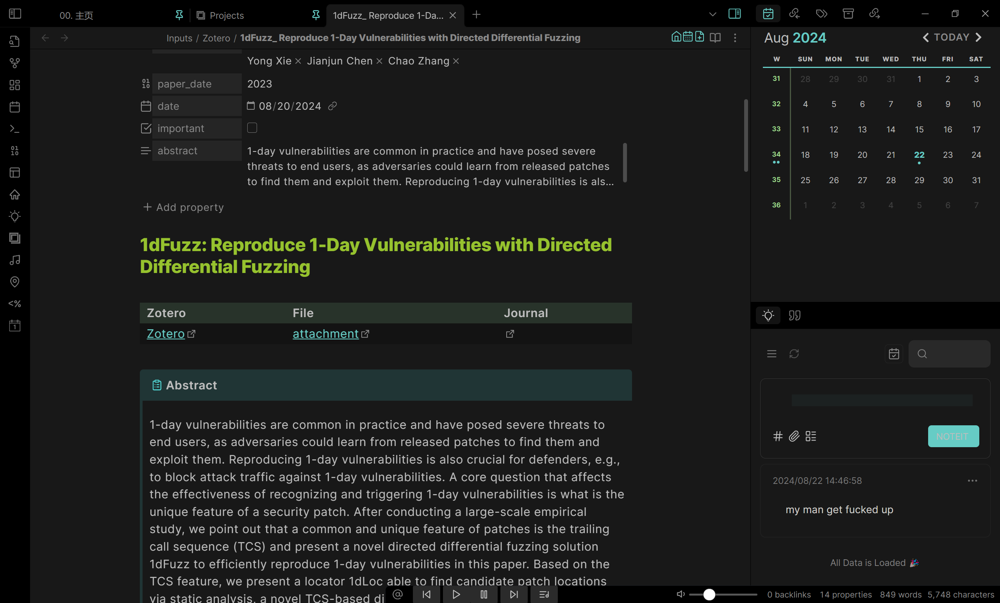
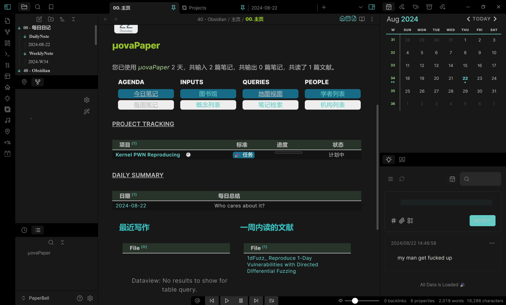

## Nova-Obsidian-Starter-Template


<div style="display: flex; justify-content: space-around;">
  
  
</div>

2.0 版本，基于 [PaperBell](https://github.com/SongshGeo/Obsidian-PaperBell) 制作，在原本的生活管理的基础上按照 PARA，以学术为导向丰富生活管理。

1.0 版本见 [v1.0](https://github.com/MuelNova/Nova-Obsidian-Starter-Template/tree/5191ef4b6e3c2ba010c83a7f5cc40cef99f037e8)

### 插件

见 [community-plugins](.obsidian/community-plugins.json)

### 配置

#### 小米手环

在 [miBand.js](Template/scripts/miBand.js) 中设置，使用的是 [MiFitness-Uploader-XPosed](https://github.com/MuelNova/MiFitness-Uploader-XPosed)

```javascript
const env = {
  URL: ["http://10.21.xx.xx:xxxxx", "http://localhost:xxxxx"],
};
```
